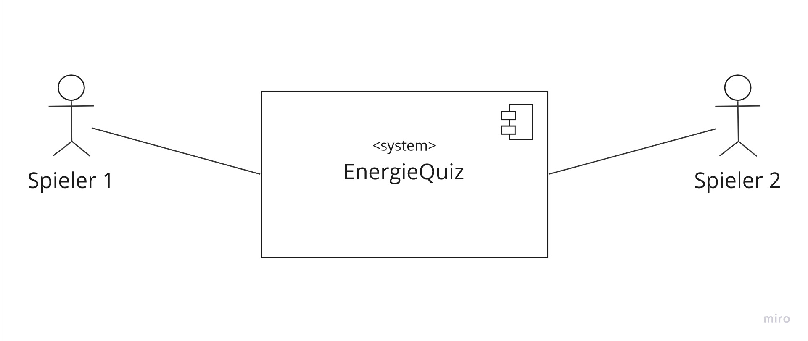
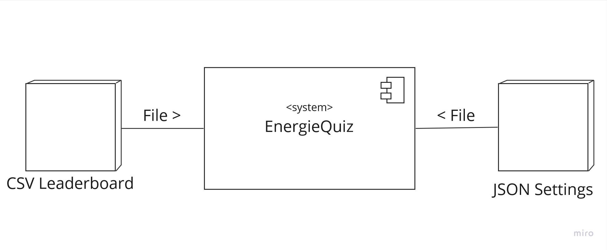

[[section-system-scope-and-context]]
== Kontextabgrenzung

=== Fachlicher Kontext

[cols="1,1,1" options="header"]
|===
| Kommunikationsbeziehung | Eingabe | Ausgabe
| Spieler 1 | Benutzereingabe über Joystick und Buttons | Anzeige über Display
| Spieler 2 | Benutzereingabe über Joystick und Buttons | Anzeige über Display
|===

=== Technischer Kontext

[cols="1,2" options="header"]
|===
| Kommunikationsbeziehung | Beschreibung
| CSV Leaderboard | Speichert die 5 besten Scores und den neusten Score mit einem Namen in einer CSV-Datei.
| JSON Settings | Speichert die verschiedenen Objekte, Räume und Fragen in verschiedenen JSON-Dateien um diese einfach zu editieren und zu ersetzen mit anderen Sprachen.
|===

Das Anbinden der Applikation mit dem Internet wurde bewusst beim Entwurf der Applikation ausgeschlossen, denn dies führt zu verschiedenen Risiken, bringt aber keine grossen Vorteile. Die Risiken beinhalten sowohl einen ungewollten Zugriff auf das System, als auch eine grössere Fehleranfälligkeit, da ohne eine Internetverbindung die Applikation nicht korrekt funktionieren würde.

