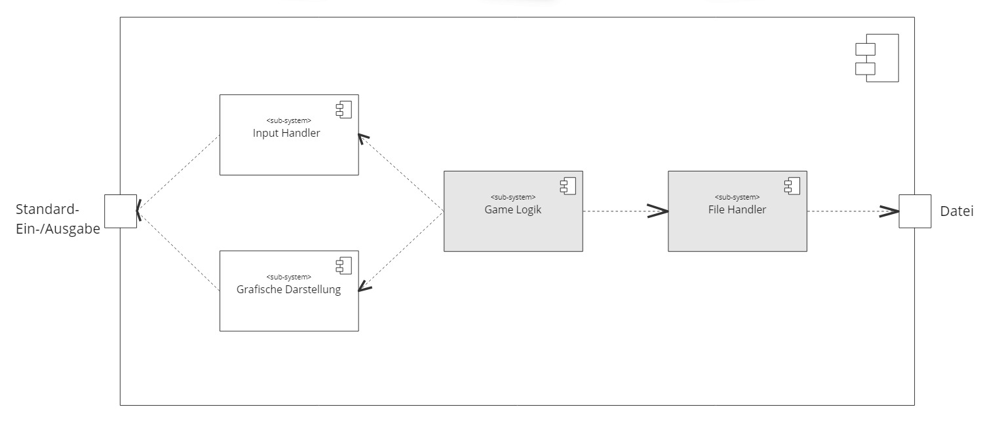
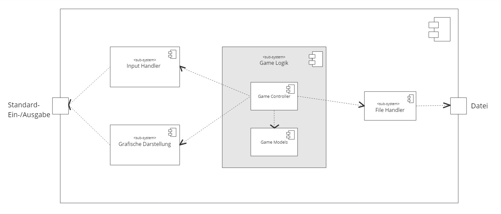
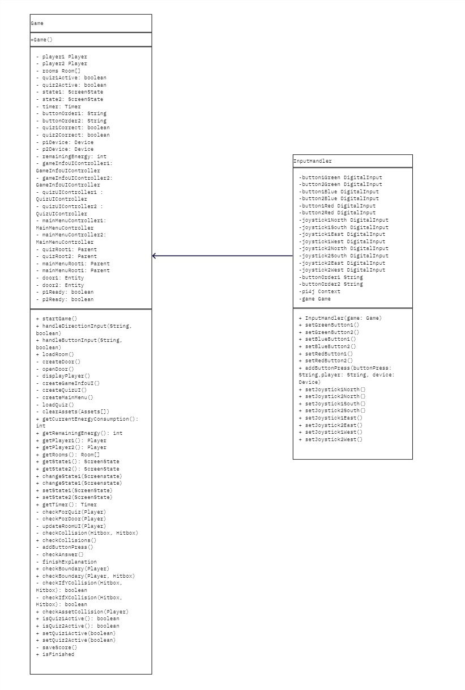
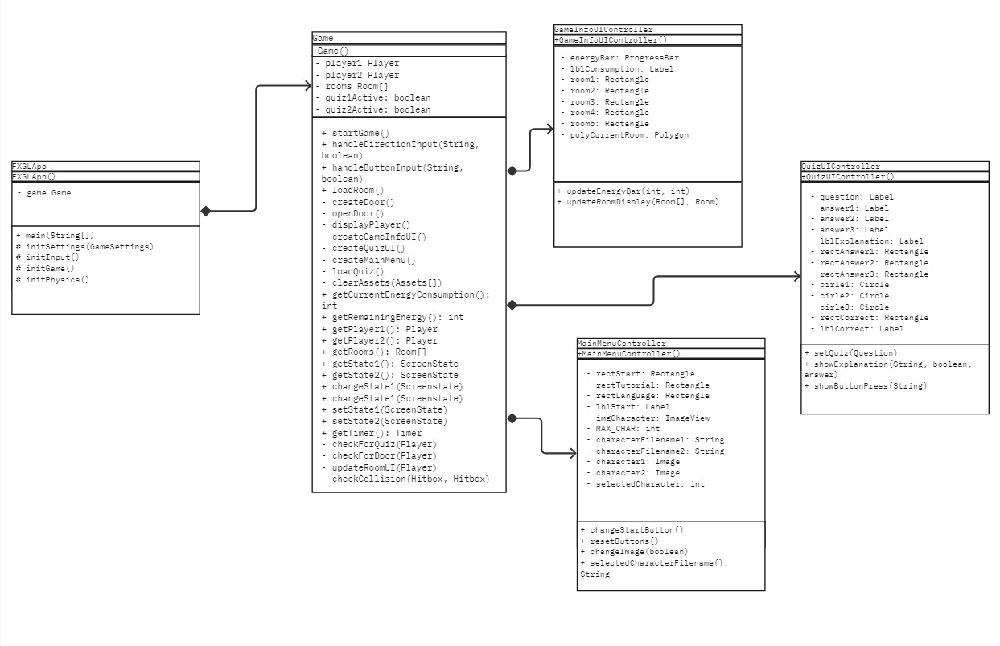
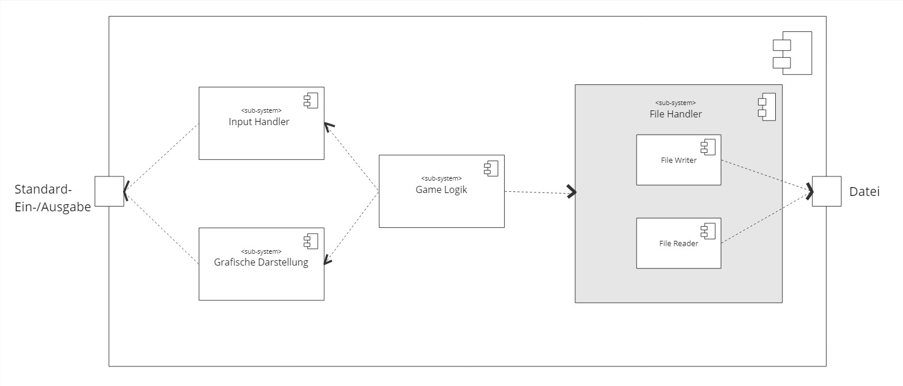
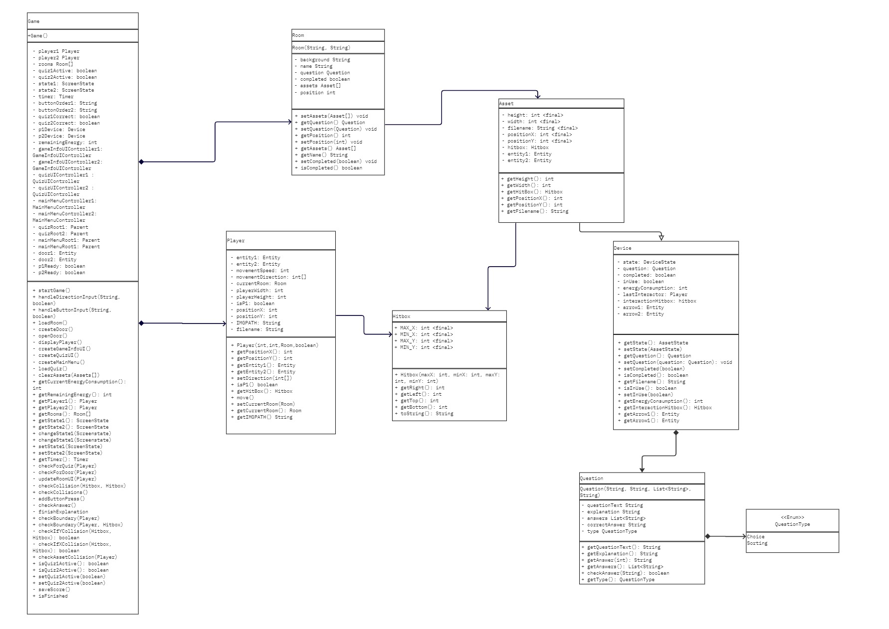

[[section-building-block-view]]
== Bausteinsicht

=== Whitebox Gesamtsystem

xref:images/UML-Class-Diagram.pdf[UML-Klassen-Diagramm]

**Übersichtsdiagramm**

Begründung:
Das System wurde folgend aufgetrennt, um die Separation-of-Concerns schon auf einem hohhen Level fest zu legen. Eigene Komponenten für das UI, das Input Handling, das File Handling und die Game Logik sorgen dafür, dass jede dieser System sich auf ihre eigenen Arbeiten konzentrieren können.

Enthaltene Bausteine:
[cols="1,10" options="header"]
|===
| Baustein | Beschreibung
| Input Handler | Empfängt die Inputs der Spieler vom Raspberry Pi und leitet die Entsprechenden Events an die Game Logik weiter.
| Grafische Darstellung | Gibt den Spielern ein Feedback zu ihren Eingaben über das UI.
| Game Logik | Verwaltet den Ablauf des Spiels.
| File Handler | Dient zum Schreiben und zum Lesen von JSON und CSV Dateien.
|===
Wichtige Schnittstellen:
Bei der Schnittstelle zu den Dateien, handelt es sich um 2 verschiedene Arten von Dateien. Zum Einen werden in einer JSON-Datei Informationen zum Spiel gespeichert und zum Anderen werden in einem CSV die Highscores des Spiels abgelegt.

==== Blackbox: Input Handler
_<Zweck/Verantwortung>_
Dieses Subsystem fangt die Inputs des Raspberry Pis ab, wandelt diese in Anweisungen um und sendet diese weiter.

_<Schnittstelle(n)>_
Die Anweisungen werden weiter an die Game Logik gesendet. Die genauere Schnittstelle zur Game Logik kann https://github.com/fhnw-sgi-ip12-23vt/IP12-23vt_energy-quiz/blob/main/documentation/software(sad)/src/05_building_block_view.adoc#blackbox-game-controller[hier] gefunden werden.

==== Blackbox: Grafische Darstellung
_<Zweck/Verantwortung>_
Dieses Subsystem dient zur Darstellung des UIs. Darin wird dem Spieler ein visuelles Feedback zu seinen Aktionen geliefert.

_<Schnittstelle(n)>_
Dieses Subsystem erhaltet den aktuellen Spielstatus aus dem Susbsystem der Game Logik und zeigt diesen entsprechend an. Eine genauere Darstellung der Schnittstelle kann https://github.com/fhnw-sgi-ip12-23vt/IP12-23vt_energy-quiz/blob/main/documentation/software(sad)/src/05_building_block_view.adoc#blackbox-game-controller[hier] aufgefunden werden

==== Blackbox: File Handler
_<Zweck/Verantwortung>_
Dieses Subsystem dient des Auslesen und Beschreiben von Dateien. Es werden JSON Dateien ausgelesen, welche die anzuzeigenden Geräte und die zu stellenden Fragen bereitstellt. Es wird eine CSV-Datei sowohl ausgelesen und beschrieben um die Highscores des Spiels zu verwalten.

_<Schnittstelle(n)>_
Die File Handler senden die ausgelesenen Daten an die Game Logik und erhalten die Daten zum Schreiben der Dateien auch aus der Game Logik. Genauere Schnittstellen werden in der Ebene 2 dargestellt.

==== Blackbox: Game Logik
_<Zweck/Verantwortung>_
Dieses Subsystem realisiert den gesamten Ablauf der Game-Loop. Es nimmt die Inputs des Input Handlers an, verwendet diese um den Spielstand zu verändern und stellt diese Änderungen dem UI zur Verfügung. Zu Beginn des Spiels werden die Assets und Quizfragen durch den FileHandler geladen und zum Schluss werde durch den Filehandler die Highscores persistiert.

_<Schnittstelle(n)>_
Die Genaueren Schnittstellen werden auf den tieferen Ebenen genauer Beschrieben, da die Game Logik auf dieser Ebene nur ein sehr grober Baustein ist.

=== Ebene 2

==== Whitebox: Game Logik

Begründung::

Das Subsystem wurde in zwei weitere Subsysteme aufgeteilt, um dem MVC-Modell zu folgen und die Separation-of-Concerns aus der ersten Ebene noch tiefer durchzusetzen.

Enthaltene Bausteine::
[cols="1,10" options="header"]
|===
| Baustein | Beschreibung
| Game Controller | Verwaltet den Spielstand, trifft Änderungen basierend auf den Anweisungen des Input Handlers und stellt der Grafischen Darstellung die neusten Änderungen bereit.
| Game Models | Repräsentieren die verschiedenen Objekte des Spiels und speichern somit die Informationen des aktuellen Spielstandes.
|===

==== Blackbox: Game Controller
_<Zweck/Verantwortung>_
Dieses Subsystem realisiert den Ablauf des Spiels und verwaltet die Informationen des Spielerinputs und des UI-Outputs. Es nimmt die Position des Controllers im MVC-Modells.

_<Schnittstelle(n)>_
Die Schnittstellen des Game Controllers sind wie folgt:

Schnittstelle Input Handler:

Das Game-Objekt besitzt einen Input Handler, welcher anhand der Benutzerinputs Signale an das Game-Objekt weiterleitet.

Schnittstelle Grafische Darstellung:

Das System der Grafischen Darstellung verwendet ein Game-Controller Objekt um den aktuellen Spielstand im UI anzuzeigen.

Schnittstelle Game Models:
Es gibt mehre Schnittstellen zu den Game Models, welche https://github.com/fhnw-sgi-ip12-23vt/IP12-23vt_energy-quiz/blob/main/documentation/software(sad)/src/05_building_block_view.adoc#ebene-3[hier] auf Ebene 3 genauer aufgezeigt werden.

==== Blackbox: Game Models
_<Zweck/Verantwortung>_
Dieses Subsystem dient zur Verwaltung der verschiedenen Game Objekte. Für die verschiedenen benötigten Objekte, werden in diesem Subsystem Klassen bereitgestellt. Es übernimmt die Rolle des Models vom MVC-Modell.

_<Schnittstelle(n)>_
Die verschiedenen Objekte werden vom Game-Controller verwendet um den aktuellen Spielstand darzustellen. Die genauere Darstellung der Schnittstellen wird https://github.com/fhnw-sgi-ip12-23vt/IP12-23vt_energy-quiz/blob/main/documentation/software(sad)/src/05_building_block_view.adoc#ebene-3[hier], auf Ebene 3, aufgezeigt.

==== Whitebox: File Handler

Begründung::
Dieses Subsystem wurde in zwei separate Komponenten aufgeteilt, um sicherzustellen, dass jede Komponente nur eine Aufgabe erfüllt und nicht mehrere verschiedene Operationen durchführen muss.

Enthaltene Bausteine::
[cols="1,10" options="header"]
|===
| Baustein | Beschreibung
| File Reader | Liest den Inhalt von JSON- und CSV-Dateien aus.
| File Writer | Schreibt und Verändert den Inhalt der CSV-Dateien mit den Highscores.
|===

==== Blackbox: File Writer
_<Zweck/Verantwortung>_
Dieses Subsystem wir dazu verwendet, um die CSV-Datei mit den Highscores zu beschreiben oder überschreiben.

_<Schnittstelle(n)>_
Dieses Subsystem wird von der Game-Logik aufgerufen, wenn das Spiel vorbei ist.  

==== Blackbox: File Reader
_<Zweck/Verantwortung>_
Dieses Subsystem dient dazu JSON und CSV Dateien auszulesen und den Inhalt dieser an den Game-Controller zurück zu geben.

_<Schnittstelle(n)>_
Dieses Subsystem wird beim initialisieren des Game-Objektes aufgerufen, um die Fragen aus dem JSON-File auszulesen.

...

=== Ebene 3

Die Ebene 3 beschreibt die tiefste Ebene der Architektur. Der einzige Baustein, welcher bisher noch nicht in seiner modularsten Form aufgezeigt wurde, wird hier als Ausschnitt eines Klassendiagramms dargestellt.

Die Klasse "Game" bezieht sich auf den Game Controller. die restlichen Klassen bilden das Subsystem der Game Models.

Diese Auftrennung wurde wie auch bei den bisher erwähnten Auftrennungnen getroffen um die Separation-of-Concerns sicherzustellen. Zusätzlich erhöht dieser Modulare Aufbau die Wartbarkeit der Software, da die Klassen eine klare Aufgabe haben und nur für diese Zuständig sind.
