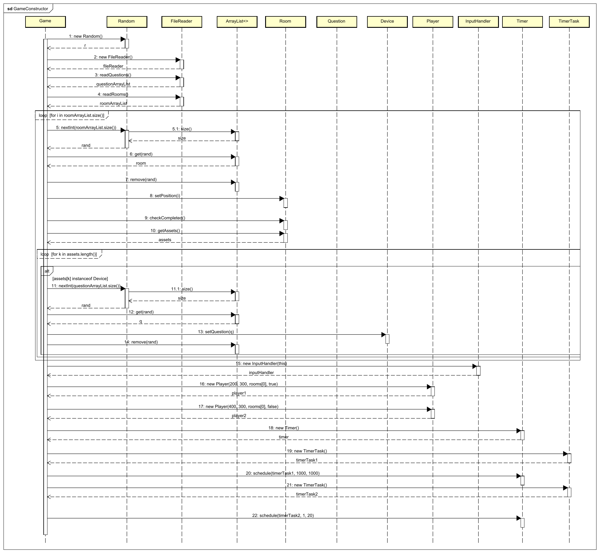
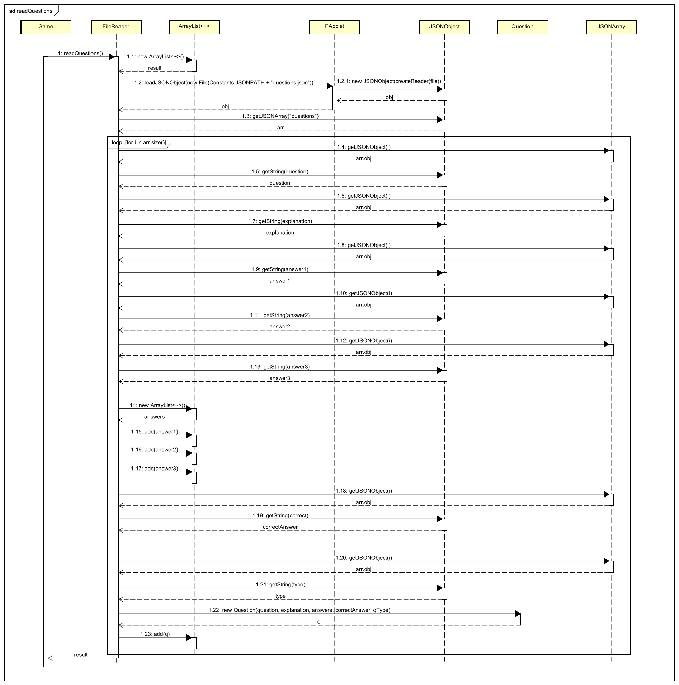
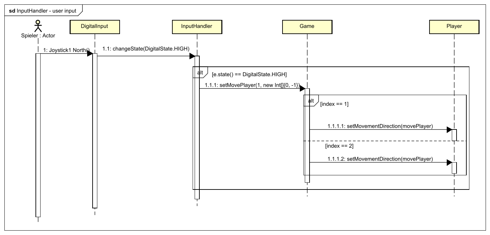

[[section-runtime-view]]
== Laufzeitsicht

=== Konstruktor des Game-Objekts

Wenn ein neues Game-Objekt initialisiert wird, werden zu Beginn die Fragen und die Räume aus einem JSON ausgelesen. Der genaue Ablauf des aulesens wird anhand der Methode "readQuestions" in einem weiteren Diagramm erklärt und deswegen werden diese beiden Methoden hier vereinfacht dargestellt.

Dann werden die Räume in einer zufälligen Reihenfolge aus der Liste genommen und es wird ihnene anhand der Reihenfolge eine Position zugeteilt, welche aussagt wie die Räume zusammenhängen.

Danach wird überprpft, ob ein Raum bereits abgeschlossen wurde und dann werden über ein Loop alle Assets geladen und mit jeweils einer zufälligen Frage beladen.

Zum Schluss werden die beiden Spieler mit ihren Startpositionen initialisiert und zwei Timer erstellt, welche für die Bewegung und das Herunterzählen des Stroms zuständig sind.

=== Auslesen der Fragen aus JSON

Beim Initialisieren des Game-Objekts wird die Methode des "readQuestions" aufgerufen.

Dort wird eine neue ArrayList erstellt und das JSON als JSONObject ausgelesen. Aus dem JSONObject wird dann das JSONArray "questions" genommen und aus diesem werden für jede Frage die verschiedenen Attribute ausgelesen und als Question-Objekt im results-array abgespeichert. Dieses wird dann dem Game-Objekt zurückgegeben.

=== Input Handler - Inputs auslesen

Wenn der erste Spieler mit seinem Joystick sich nach oben bewegt, wird ein Signal zum RaspberryPi gesendet. Dies wird von der Applikation abgefangen, da sich auf dem vordefinierten Pin die Spannung ändert. Bei Spannungsänderung wurde beim DigitalInput definiert, was passieren sollte.

Wenn es sich um den DigitalState.HIGH handelt, wird die dem Game-Objekt gesagt, dass sich der Spieler "1" nach oben bewegen soll. Beim Game-Objekt wird zuerst dann überprüft, welcher Spieler sich bewegen soll und dessen Bewegungsrichtung wird dann angepasst.
