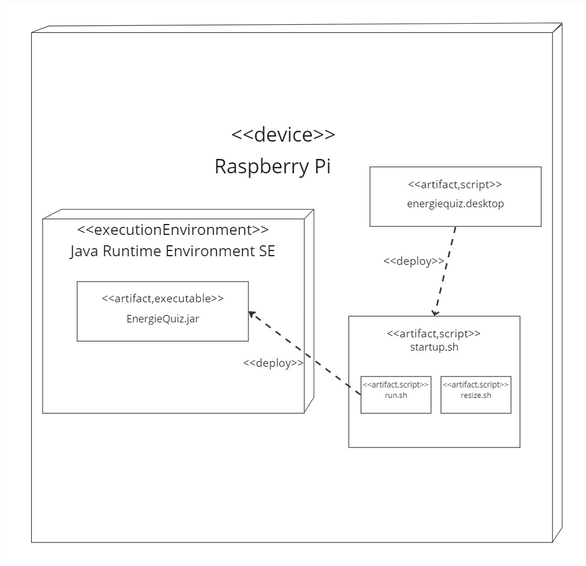

[[section-deployment-view]]
== Verteilungssicht

=== Infrastruktur Ebene 1

Begründung::

Die ganze Applikation befindet sich auf einem Raspberry Pi. Dieser wird in einem Kasten verbaut und mit zwei Joysticks, 6 Knöpfen verbunden und 2 Monitoren verbunden.

Die Software befindet sich nur auf einem Raspberry Pi, da die Leistung von einem ausreicht und die Kommunikation zwischen 2 Raspberry Pis zu nicht notwendigen Komplikationen führen kann.

Zusätzlich wurde die Verwendung eines Raspberry Pis als Anforderung der FHNW festgelegt und musste somit auf dieser Weise umgesetzt werden.

Qualitäts- und/oder Leistungsmerkmale::

Durch diesen Aufbau wird auf das Qualitätsmerkmal der Nachhaltigkeit geachtet, denn die benötigten technischen Geräte sind somit minimiert. Zusätzlich kann das Leistungsmerkmal der schnellen Antwortzeit gewährt werden, da keine Kommunikation ausserhalb des Hauptgeräts notwendig ist.

Zuordnung von Bausteinen zu Infrastruktur:: 

Alle im Kapitel 5 erwähnten Bausteine befinden sich auf dem Raspberry Pi.

Der Baustein des Input Handlers hört auf der Verbindung des Raspberry Pis mit den Knöpfen und Joysticks auf Änderungen und teilt diese der Game Logik mit.
