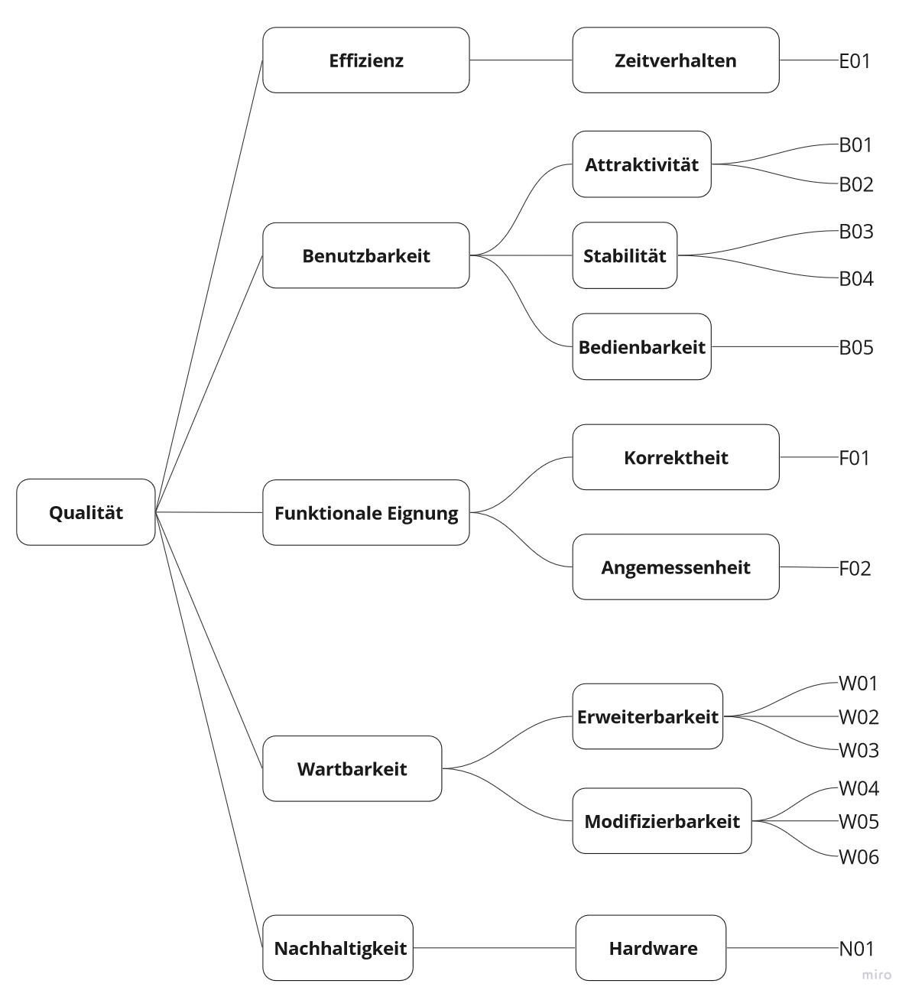

[[section-quality-scenarios]]
== Qualitätsanforderungen

=== Qualitätsbaum

=== Qualitätsszenarien

[cols="1,10,10" options="header"]
|===
| ID | Szenario | Testvorgehen 
| E01 | Eine Schulklasse voller 13 jähriger kommt zur Ausstellung von Primeo. Sie spielen das Spiel und es läuft flüssig mit mindestens 30 FPS. | Profiling in FXGL aktiviert und auf dem Raspberry Pi die Framerate abgelesen. 
| B01 | Eine Schulklasse voller 13 jähriger kommt zur Ausstellung von Primeo. Ihnen Gefällt das Design und das Spielprinzip. | Testen mit der Zielgruppe wie im https://fhnw-projecttrack.atlassian.net/wiki/spaces/IP1223vt5/pages/63997316/Usability+Dossier#Usability-Testing-1[Usability-Testing] und im https://fhnw-projecttrack.atlassian.net/wiki/spaces/IP1223vt5/pages/356515847/Zielgruppen+Tests+2[Zielgruppen Testing] beschrieben.
| B02 | Eine Schulklasse voller 16 jähriger kommt zur Ausstellung von Primeo. Sie finden den Inhalt des Spiels und das Prinzip ansprechend. | Testen mit der Zielgruppe wie im https://fhnw-projecttrack.atlassian.net/wiki/spaces/IP1223vt5/pages/63997316/Usability+Dossier#Usability-Testing-1[Usability-Testing] und im https://fhnw-projecttrack.atlassian.net/wiki/spaces/IP1223vt5/pages/356515847/Zielgruppen+Tests+2[Zielgruppen Testing] beschrieben.
| B03 | Eine Schulklasse voller 13 jähriger kommt zur Ausstellung von Primeo. Sie können so viel sie wollen auf dem Gerät herumhauen ohne das dieses direkt kapputt geht. | Mit etwas Kraft gegen verschiedenste Stellen gedrückt und mit dem Körpergewicht auf den Kasten gedrückt.
| B04 | Eine Schulklasse voller 16 jähriger kommt zur Ausstellung von Primeo. Sie können ganz oft die Knöpfe und den Joystick betätigen ohne, dass es dabei zu Schäden kommt. | Am Gerät selbst mit etwas Kraft ganz oft hintereinander zufällig auf die Knöpfe gedrückt und geschaut was passiert.
| B05 | Eine Schulklasse voller 13 jähriger kommt zur Ausstellung von Primeo. Innerhalb einer Minute verstehen sie das Prinzip und die Steuerung und können problemlos spielen. | Testen mit der Zielgruppe wie im https://fhnw-projecttrack.atlassian.net/wiki/spaces/IP1223vt5/pages/63997316/Usability+Dossier#Usability-Testing-1[Usability-Testing] beschrieben.
| F01 | Der Kunde schaut sich das Produkt an. Alle erwarteten Anforderungen sind in der Applikation erischtlich oder andersweitig dokumentiert. | Dokumentation wurde von Personen im Team angeschaut, welche nicht viel mit diesem Bereich zu tun hatten und somit wurde validiert, dass alles verständlich und ersichtlich ist.
| F02 | Das Produkt wird der Zielgruppe von 13-16 Jährigen vorgelegt. Diese können durch das Spiel weiteres dazu lernen ohne Überfordert zu werden. | Dies wurde anhand des https://fhnw-projecttrack.atlassian.net/wiki/spaces/IP1223vt5/pages/356515847/Zielgruppen+Tests+2[Zielgruppen Testing] überprüft.
| W01 | Nach der Übergabe an Primeo, wollen sie neue Fragen zum Spiel hinzufügen. Die Techniker können einfach den Kasten aufmachen, Maus und Tastatur and den Raspberry Pi anschliessen und eine JSON-Datei bearbeiten. In dieser Datei können sie nach dem vorhandenen Schema neue Fragen hinzufügen. | Wird durch ein Teammitglied getestet, welches bei dieser Implemenation nicht mitgewirkt hat. Es wird durchgespielt, um zu sehen, ob es einfach verständlich ist, mit der Anleitung im https://gitlab.fhnw.ch/ip12-23vt/energiequiz/energiequiz/-/blob/main/README.md?ref_type=heads[ReadMe].
| W02 | Nach der Übergabe an Primeo, wollen sie neue Geräte zum Spiel hinzufügen. Die Techniker können einfach den Kasten aufmachen, Maus und Tastatur and den Raspberry Pi anschliessen und eine JSON-Datei bearbeiten. In dieser Datei können sie nach dem vorhandenen Schema neue Geräte hinzufügen. Zusätzlich können sie in einem resources-Ordner Grafiken für die neuen Geräte hinzufügen. | Wird durch ein Teammitglied getestet, welches bei dieser Implemenation nicht mitgewirkt hat. Es wird durchgespielt, um zu sehen, ob es einfach verständlich ist, mit der Anleitung im https://gitlab.fhnw.ch/ip12-23vt/energiequiz/energiequiz/-/blob/main/README.md?ref_type=heads[ReadMe].
| W03 | Nach der Übergabe an Primeo, wollen sie neue Räume zum Spiel hinzufügen. Die Techniker können einfach den Kasten aufmachen, Maus und Tastatur and den Raspberry Pi anschliessen und eine JSON-Datei bearbeiten. In dieser Datei können sie nach dem vorhandenen Schema neue Räume hinzufügen. Zusätzlich können sie in einem resources-Ordner Hintergrundgrafiken für die neuen Räume hinzufügen. | Wird durch ein Teammitglied getestet, welches bei dieser Implemenation nicht mitgewirkt hat. Es wird durchgespielt, um zu sehen, ob es einfach verständlich ist, mit der Anleitung im https://gitlab.fhnw.ch/ip12-23vt/energiequiz/energiequiz/-/blob/main/README.md?ref_type=heads[ReadMe].
| W04 | Nach der Übergabe an Primeo, wollen sie die Fragen des Spiels verändern, da eine der Fragen unklar gestellt wurde. Die Techniker können einfach den Kasten aufmachen, Maus und Tastatur and den Raspberry Pi anschliessen und eine JSON-Datei bearbeiten. In dieser Datei können sie die betroffene Frage umformulieren. | Wird durch ein Teammitglied getestet, welches bei dieser Implemenation nicht mitgewirkt hat. Es wird durchgespielt, um zu sehen, ob es einfach verständlich ist, mit der Anleitung im https://gitlab.fhnw.ch/ip12-23vt/energiequiz/energiequiz/-/blob/main/README.md?ref_type=heads[ReadMe].
| W05 | Nach der Übergabe an Primeo, wollen sie gewisse Grafiken anpassen, da die einige der vorhandenen Grafiken noch besser gestaltet werden können. Die Techniker können einfach den Kasten aufmachen, Maus und Tastatur and den Raspberry Pi anschliessen in einem resources-Ordner die bestehenden Grafiken für die ersetzen. | Wird durch ein Teammitglied getestet, welches bei dieser Implemenation nicht mitgewirkt hat. Es wird durchgespielt, um zu sehen, ob es einfach verständlich ist, mit der Anleitung im https://gitlab.fhnw.ch/ip12-23vt/energiequiz/energiequiz/-/blob/main/README.md?ref_type=heads[ReadMe].
| W06 | Nach der Übergabe an Primeo, wollen sie eine neue im Spiele eine neue Sprache anbieten. Die Techniker können einfach den Kasten aufmachen, Maus und Tastatur and den Raspberry Pi anschliessen und die bestehende JSON-Datei mit einer Neuen im gleichen Schema ersetzen. | Wird durch ein Teammitglied getestet, welches bei dieser Implemenation nicht mitgewirkt hat. Es wird durchgespielt, um zu sehen, ob es einfach verständlich ist, mit der Anleitung im https://gitlab.fhnw.ch/ip12-23vt/energiequiz/energiequiz/-/blob/main/README.md?ref_type=heads[ReadMe].
| N01 | Das Produkt wird bei Primeo ausgestellt. Sie können am Kasten der Maschine sehen, dass Nachhaltigkeit beim Bau des Kastens in Betracht gezogen wurde. | Man kann sehen, dass die Bildschirme nicht die neusten sind und der Kasten selbst besteht aus Holz.
|===

Weitere Qualitätsanforderungen wurden auch im Requirements Engineering festgelegt und können https://fhnw-projecttrack.atlassian.net/wiki/spaces/IP1223vt5/pages/63997213/Requirements#Qualit%C3%A4tsanforderungen[hier] gefunden werden.